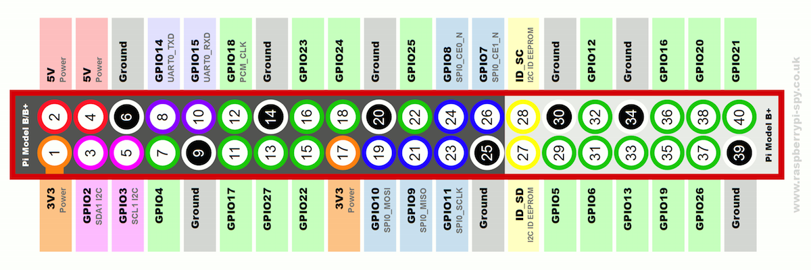

# Setup ATmega328

see http://www.gammon.com.au/forum/?id=11637 or https://www.arduino.cc/en/Tutorial/ArduinoToBreadboard


## Pin Layouts

 

 


## Burn Bootloader on Atmega


 

* Connect Cables like on the layout above + **add 10k pullup resistor between ATMega's RESET PIN and VCC**

* Download Sketches from this page: https://github.com/nickgammon/arduino_sketches

* Run Atmega_Board_Detector to see if there is a bootloader installed. 

  * If chip is not detected, it might meed a crystal: connect ATMega's D9 Clock pin with Arduino digital pin 9 to emulate the crystal

* Run Atmega_Board_Programmer to install liliypad bootloader, 

  * open serial console. Send L, then G

      ​

## Upload Sketches to Atmega328


 
* First upload Bootloader (see above)
* Connect cables like in the layout above or use FTDI Serial Adapter
  * **Important: add 0,1 - 10 uF Capacitor between RESET and ATMega's pin1 (RST)**
  * RX -> TX, TX -> RX, VCC -> 5V, GND -> GND, RST -> RESET / DTR

  * If using arduino, remove Atmega from Arduino
* Upload Sketches using Lilypad Arduino with atmega328 chip
* Programmer: AVR mkII

## Serial Connection with rasp pi

* Connect GND to GND, Atmega RX (pin2) to GPIO 14 (TXD), Atmega TX (pin3) to GPIO 15 (TXD)
* **Make sure atmega runs on 3.3V**
* prevent rasp pi from broadcasting boot messages over serial
  * `sudo nano /boot/cmdline.txt`
  * change content to `root=/dev/mmcblk0p2 rw rootwait console=tty1 selinux=0 plymouth.enable=0 smsc95xx.turbo_mode=N dwc_otg.lpm_enable=0 elevator=noop` (delete both entries with xxxx=ttyAMA0,115)
  * enable tty: `sudo systemctl enable getty\@tty1.service`

* Python test code:

  ```python
  import serial
  ser = serial.Serial(‘/dev/ttyAMA0’, 9600, timeout=1)
  ser.open()

  ser.write(“testing”)
  try:
      while 1:
          response = ser.readline()
          print response
  except KeyboardInterrupt:
      ser.close()
  ```
