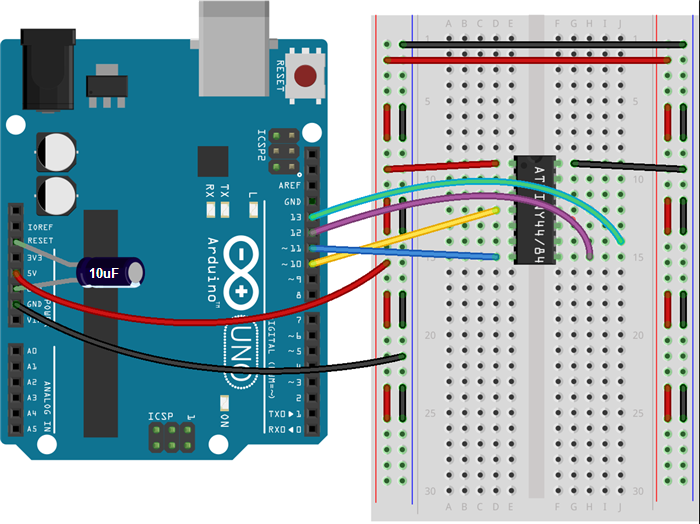

# Setup Attiny

## Connect Attiny84 to Arduino Uno

### Install Attiny support for Arduino IDE

* add to board mananager: Preferences -> Addiotional Board Manager repositorys: `https://raw.githubusercontent.com/damellis/attiny/ide-1.6.x-boards-manager/package_damellis_attiny_index.json`
* Board Manager -> Install ATtiny board

### Pogram Attiny84 with Arduino

* Upload ArduinoISP Sketch from examples to arduino uno **without connected capacitor** and Programmer `AVR ISP`
* **Connect capacitor GND to RESET.**
* Choose attiny and programmer: `Ardunio as ISP`
* Burn bootloader
* Upload the sketch

## Upload letterbox sketch

## Attiny Pin Connections

* VCC -> 3V

* PIN 10 -> Serial (TX)
* PIN 9 -> Serial (RX)
* PIN 0 -> ULN2003 1
* PIN 1 ->  ULN2003 2
* PIN 2 -> ULN2003 3
* PIN 3 ->  ULN2003 4
* PIN 8 -> Reed Switch
* PIN 7 -> Photoresistor
* PIN 4 -> ~~Camera LED~~
* PIN 5 -> Status LED
* PIN 6 -> Feedback LED

## Useful Links

### Attiny84 Layout

### Attiny Setup

* http://highlowtech.org/?p=1695

### Serial Communication attiny <> rasp pi

* http://www.forum-raspberrypi.de/Thread-serial-ueber-gpio
* Cool Term for Mac: http://freeware.the-meiers.org/
* SoftwareSerial Lib for attiny: https://www.arduino.cc/en/Reference/SoftwareSerial

### Stepper motor

* <http://www.geeetech.com/wiki/index.php/Stepper_Motor_5V_4-Phase_5-Wire_%26_ULN2003_Driver_Board_for_Arduino>