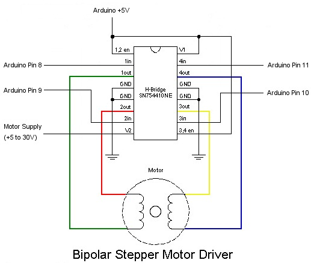

# Letterbox Hardware

## Headboard

### Pin Layout

 

 

## Camera Board

* Transistor Base: 330 Ohm Resistor to GPIO
* Transitor: 547 NPN (Footprint: TO-92)
* LED 20mA Through hole White:  Resistor 100 Ohm each
* SMD LEDs white 3x20mA: http://www.produktinfo.conrad.com/datenblaetter/175000-199999/183097-da-01-en-LED_TOP_VIEW_NEUTRALWS_STW9T36B_D.pdf
  * missing triangular edge marks the vcc pins, opposite site is gnd **(check before soldering, normally it should be the other way around)**
  * resistor for SMD TRIPLE LED (60mA) 3.2 V: 33 Ohm

## Headboard

### Photoresistor

* Pin 23 (A0) with 10 kOhm pulldown resistor

### Serial Connector

* 10uF 50V Capacitor (Footprint: D5 L11)
* 10 kOhm Resistor to 5V
* TX: PIN1, RX: PIN0

### Reed Switch

* PIN4 with 10 kOhm Current limiting resistor

## Stepper

* Driver: SN754410 Half Bridge
* Connected Pins: 

## Problems

- Headboard
  * [x] Make Serial port a 5 pin port (rx, tx, vcc, gnd, dts) to be able to program atmega with turned of rasp pi. or: jumper to block serial connection to rasp pi
  * [x] Connect all gnds,5v and 3v together to be able to power it from another power src than rasp pi
  * [x] mixed up RX and TX Connection to rasp pi
  * [ ] ~~Feedback LED on wrong pin for wpm: do we need that?~~
  * [ ] mark + on led pin headers, mark stepper header
  * [ ] transistor holes too far apart
  * [x] **STILL TO TEST:** mixed up RX / TX on serial connector to atmega. cross RX <-> TX, take care to not change this on rasp pi
  * [ ] spannungsabfall an den beiden dioden zu hoch, entfernen?
- Camera Board
  * [ ] Move power connector to bottom side
- Stepper Board
  * [ ] Hard to solder via on upper fill. Need to put wire between the two ground holes or find another solution